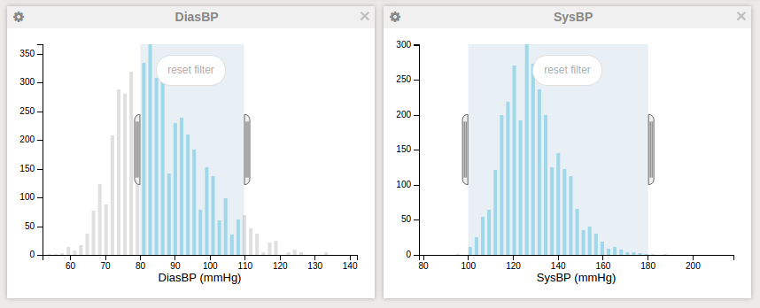
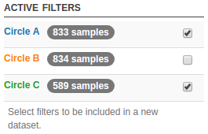
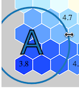

# User guide

## Technical requirements

### Device
EpiMetal is intended to be used on a desktop device rather than a tablet or a smartphone.

### Browser

Latest version of [Google Chrome](http://google.com/chrome) is highly recommended. Internet Explorer versions and Microsoft Edge are not supported. Mobile browsers such as as those used in smartphones and tablets are discouraged for performance and usability reasons.

## Navigation

The application is divided to a side menu, a header bar, and a content section.

### Header bar
The header bar contains links to three views of this application: [Explore and filter](userguide.md#explore-and-filter), [Self-Organizing Maps](userguide.md#self-organizing-maps) and [Regression analysis & associations](userguide.md#regression-analysis-associations).

The right-hand side of the header bar contains a **Link this view** button. This button opens a menu to save the current state of the application that is currently displayed. The link provided on the opening pop-over can be used to share the contents to other collaborators. Please note that the link provided is not a permanent link: there is no guarantee that the link is functional after 30 days.


*Link this view opened.*

Whenever time-consuming computations are being made, two indicators appear on the right-hand side of the header bar. These computations include the training of Self-Organized Map, creating or updating a heat map, and regression analysis. The left-hand side indicator is a round progress bar. By pressing on the `Cancel tasks` button, any active computations are cancelled. As a consequence, any figures depending on this task will be closed.


*Circular progress bar and a button for cancelling any active computational tasks.*

### Side menu
The side menu content varies based on the active view and state of the application. To increase the width of the actual page contents, the menu can be hidden by pressing **Hide this menu**.

Most of the user actions are controlled through this menu.

#### Datasets
EpiMetal operates by displaying various types of figures that are drawn based on the active selection of samples. The samples are part of a dataset. EpiMetal supports two kinds of datasets: static datasets and datasets created on-the-go by selecting a subset of samples with filters. Any dataset can be selected or inactivated, and figures presented on the content section are updated to reflect any changes on the active datasets.

Static datasets are preloaded from the database, and in the default view they are all selected as active. Static datasets cannot deleted.

The user can choose to operate on a specific subset of samples by first creating several filters. Then, this active sample set can be "frozen" as a dynamic dataset by naming it on the **Make a new dataset** field and then pressing the **Create dataset** button. The resulting dataset is then added to the list of datasets. Dynamically created datasets can be deleted as opposed to datasets originating from database which are static.

#### Manage windows

*The manage windows* section displays the windows created on the view's window canvas. You can toggle the visibility of any such windows, or choose to close all windows by type.


*Example of manage windows section. In this example, a total of 12 figure windows are present. 3 box plots and a regression heatmap have been hidden by the user.*


#### Filters
The side menu displays a list of active filters if any are present. 

##### Explore and filter view
On the [Explore and filter](userguide.md#explore-and-filter) view, histograms can be filtered by clicking and dragging over the figure.  These filters are only active on the current view and are removed when you navigate between views. If you wish to keep the active selection created with filters, you can freeze the sample selection by creating a new dataset as described in [datasets](userguide.md#datasets).



*Two figure windows that each have a range filter applied.*

The corresponding active filter list as it would be displayed on the side menu:


*Active menu displaying the two active filters from previous figure.*

The numerical values of each active filter can be modified in the input fields representing the upper and lower limit of the filter. 

##### Self-Organizing Map view
On the [Self-Organizing Maps view](userguide.md#self-organizing-maps) filters are called *circle filters*. By default two circle filters are created, named A and B. They are placed over the SOM planes on a random coordinate. Circle filters can be moved by dragging them.


*Example SOM plane with three circle filters.*

The active filters are displayed on the side menu:



*Active list showing circle filters.*


 A circle filter can also be resized by dragging the circle filter from its edge.



*Resizing a circle filter.*

The filters can be created and removed as needed: to create a circle filter, first name it by filling the text field under `Manage circle filters` and then press **Create circle**. Any existing figures on the view will be updated on creation to reflect the new circle filter.

Circle filters can also be used to create a dynamic dataset. To do this, first select any circle filters whose samples are to be added to the dataset on the *Active filters* section of the side menu by clicking on its checkbox. 


***Creating a dataset from circle filters, step 1**: Select the filters that encircle the selection of samples you want to include.*

Then, supply a unique descriptive name for the dataset under the *Make a new dataset* field and press **Create dataset**. 


***Creating a dataset from circle filters, step 2**: name your selection.*

Any duplicate samples (i.e. the circle filters intersect) are added only once. The created dataset then appears on the dataset list. The newly-created dataset is inactive by default.


***Creating a dataset from circle filters, step 3**: the resulting dynamic dataset is now displayed on the dataset list. Lengthy names are truncated, as in this case.*


## Views
### Explore and filter
This is the default view of the application. The content section consists of a canvas that is populated with windows containing figures. By default, five windows are displayed containing the histograms of `Serum-C`, `Serum-TG`, `HDL-C`, `LDL-C` and `Glc` variables.

New figures can be added by clicking on the **Create a new graph** button and selecting a variable or variables. Several figure types are supported:

* [Histogram](userguide.md#histogram)
* [Scatterplot](userguide.md#scatterplot)
* [Heatmap](userguide.md#heatmap)
* [Box plot](userguide.md#box-plot)

#### Figure windows
The windows can be resized, dragged and removed from the canvas as user chooses. A cogwheel on the top-left of the window contains a set of options for the window. These available options vary based on the displayed figure type. For instance, [a histogram](userguide.md#histogram) can be exported either in SVG or PNG format through this dropdown.


*Settings dropdown for figure window opened up. Two options are available for this histogram: export the figure in PNG or SVG format.*

### Self-Organizing Maps
When entering this view, the application either calculates a Self-Organizing Map (SOM) or uses a pre-calculated result if one is available. The SOM is calculated based on the active samples and the train variables.

#### Settings
The SOM settings can be adjusted by clicking **Adjust SOM settings** from the side menu. The settings include modifying the train variables as well as the size.

##### Input variables
The displayed variable selection contains the current variables which have been used to compute the current SOM. Modifying the variable selection and pressing **Submit** results in the recomputation of the SOM. 

If you made an error in selecting the variables or otherwise wish to cancel the calculation, you can do so by pressing on the **Cancel computation tasks** button that is displayed on the header bar.

##### Size

The SOM grid size can be changed. Three options are available:

* 5 rows, 7 columns
* 7 rows, 9 columns
* 9 rows, 13 columns

Changing the size will trigger a retrain of the SOM and recompute all the visible SOM planes.

##### Pivot variable

When a pivot variable is defined, a rank transformation is performed to the training samples prior to SOM training phase. Whether this pivot feature is enabled is defined during the [installation phase](installation.md#default-view-settings). That is, the installation settings will determine whether to use SOM training at all, and what is the default variable to. Even if the pivot variable is disabled in the installation phase, you can enable it on a session-by-session basis.

**Note that that each of the samples used must have a value of this pivot variable that can be coerced to a number. Failing to meet this requirement will have unexpected consequences in the SOM results.**


#### Display hexagons selected by circle filters

Often times it may be useful to see which hexagons have been selected within a particular plane. In this case, click on the plane's cogwheel and select *Toggle hexagon highlighting*.


*Displaying which hexagons have been selected by circle filters.*

The plane is then updated to show every hexagon which has been selected by the circle filters. The hexagon selection is indicated by coloring its border with the respective circle filter's color. 

In the case where two or more circle filters intersect and thereby select one or more of the same hexagons, the border color will only reflect one of those circle filters. Note that this is only a display limitation; naturally all of the intersecting circle filters will contain the samples included in those intersecting hexagons.


### Regression analysis & associations

In this view multiple linear regression analysis can be computed and its results can be viewed. Start by clicking on **Create a new regression view** button. 

Analyze the statistical association between a set of variables (*exposure variables*) to *a outcome variable*. Optionally, the regression analysis can also be adjusted for a variable or variables by filling in the *covariates* field.

The figure window first appears blank with a circular progress indicator that shows the progress of the calculation. The computation is done in parallel and should complete in well under a minute, depending on the resources of your computer and the amount of samples being processed.

#### Exporting results
The results of any produced analyses can be exported by selecting the *Download regression data in a ZIP file* option under the cogwheel menu of a forest plot window. 


This allows the user to download a ZIP archive file that contains the following files:

| File name | Description |
|----------|-------------|
| covariates.txt | Covariates used in the analysis. One variable per line. |
| exposure_variables.txt | Exposure variables used in the analysis. One variable per line. |
| outcome_variable.txt | Outcome variable used in the analysis. One line containing the variable name. |
| result_[dataset name].tsv | N distinct tab-separated values (TSV) files containing numerical values of the analysis, where N is the amount of datasets used in the analysis.|

The result TSV file contains the following columns:

| Colum name | Value type | Description |
| ---------- | ---------- | ----------- |
| variable   | String     | Name of the exposure variable |
| computation_succeeded | Boolean: **True** / **False** | Whether the computation succeeded. If the result is **False**, the following numerical columns will have value NaN |
| data_source | String | The dataset name. Should be the same for each row in the same file |
| beta0 | Float | The standardized regression coefficient, or Beta 0, for this variable |
| beta1 | Float | The standardized regression coefficient, or Beta 1, for this variable |
| CI1 | Float | Lower endpoint of the 95% confidence interval |
| CI2 | Float | Upper endpoint of the 95% confidence interval |
| p_value | Float | P-value. The number 0 is presented in the case the number precision is not sufficient to display such a small number. |


## Figures 

### Histogram

Histograms can be drawn either on the [Explore and filter](userguide.md#explore-and-filter) or the [Self-Organizing Maps](userguide.md#self-organizing-maps) view.

On *Explore and filter* view the histogram is drawn based on the active set of samples. User can select a range sample values to explore further by clicking and dragging over the figure area. On a quantitative variable, this creates a **range filter** that is displayed on the [side menu](userguide.md#side-menu).


*Example of histogram of a quantitative variable. A range filter is active.*

### SOM Distribution
An extension of histograms explained in the previous section. On *Self-Organizing Maps* view the histogram sample data is sourced from the samples that are selected with circle filters. In addition, a third distribution - in grey - is placed on background of the stacked figure to signify all the samples that have been used in the training phase.

For every active circle filter, a distribution with the corresponding color is displayed. A Gaussian kernel regression smoothing curve is displayed for every filter's distribution, with the parameter bandwidth = 0.10.


*The distribution of variable BMI (in gray). Two circle filters are active in this example and the distributions for their sample selections can be seen.*

### Scatter plot
A scatter plot contains the dots originating from each active dataset. The top-right corner of the figure contains the regression line equations.

#### Toggling
By selecting `Toggle figure pooling` from the options dropdown the active dots are pooled and displayed in black. In this case, a single regression line is displayed instead of separate lines for each active dataset.

### Heatmap
A correlation heatmap from any available variables can be drawn in the [Explore and filter](userguide.md#explore-and-filter) view. The maximum number of variables that can displayed within any heatmap is 100. The active samples used as as source for this figure can either be separated to distinct figures based on the dataset (`Separate heatmaps for each dataset`), or be used together to create a single heatmap (`One combined heatmap`).

In the case of separate heatmaps sfor each dataset, if the dataset which is used as the sample source for a heatmap is deselected the window containing the figure is automatically removed from the canvas.

The heatmap cells can be clicked to draw the corresponding scatter plot of the two variables.

#### P value cut-off
The Bonferroni adjustment is is used to maintain a familywise error Type I error rate of 0.05. The displayed cut-off value is the adjusted alpha level. Heat map cells having a p value that exceeds the adjusted alpha level are displayed in white color. You can disable the Bonferroni adjustment by clicking on `Toggle correlation cutoff of p < value` on the upper-left settings menu. This will update the heat map to show all pairwise correlation colors regardless of their respective p value and whether they meet the cut-off criterion.

#### Default color scale

By default, a correlation heatmap uses a linear color scale (shown right of the heatmap) of three value points: 1 is full red, 0 is white and -1 full blue. 

#### Color scale stretching

In some cases the default color scaling is not the desired behavior. Consider the case where the correlation values concentrate on a small number range. In this case, the default scaling does not distinguish the values sufficiently by assigning distinct colors. 

By clicking `Toggle color scale stretching` in the figure window options, EpiMetal assigns 75% of the upper or lower color range to the correlation value range. For instance, if the highest positive correlation was at r = 0.99 and lowest at r = 0.85, and negative correlations span from r = -0.2 to r = -0.35, the colors would be mapped as follows:

* 100% red at r = 0.99
* 25% red at r = 0.85
* white at r = 0 or beyond the p value cut-off
* 25% blue at r = -0.25
* 100% blue at r = -0.35

### Box plot

A box plot can drawn either on the [Explore and filter](userguide.md#explore-and-filter) or the [Self-Organizing Maps](userguide.md#self-organizing-maps) view. 

On *Explore and filter* view, the data source is the active sample selection consisting of datasets. 

On *Self-Organizing Maps* view, the data originates from subselection of samples confined by the circle filters. That is, one box plot is displayed for each circle filter present and its color corresponds with the color of the box plot.

### Profile histogram

A profile histogram can be drawn on the [Self-Organizing Maps](userguide.md#self-organizing-maps) view. The available profile histograms are defined during [installation phase](installation.md#default-view-settings). By default, three distinct predefined histograms are available:

Total lipids:

 * XXL-VLDL-L (Total lipids in chylomicrons and extremely large VLDL)
 * XL-VLDL-L (Total lipids in very large VLDL)
 * L-VLDL-L (Total lipids in large VLDL)
 * M-VLDL-L (Total lipids in medium VLDL)
 * S-VLDL-L (Total lipids in small VLDL)
 * XS-VLDL-L (Total lipids in very small VLDL)
 * IDL-L (Total lipids in IDL)
 * L-LDL-L (Total lipids in large LDL)
 * M-LDL-L (Total lipids in medium LDL)
 * S-LDL-L (Total lipids in small LDL)
 * XL-HDL-L (Total lipids in very large HDL)
 * L-HDL-L (Total lipids in large HDL)
 * M-HDL-L (Total lipids in medium HDL)
 * S-HDL-L (Total lipids in small HDL)
----

Fatty acids:

* TotFA (Total fatty acids)
* UnSat (Estimated degree of unsaturation)
* DHA (22:6, docosahexaenoic acid)
* LA (18:2, linoleic acid)
* FAw3 (Omega-3 fatty acids)
* FAw6 (Omega-6 fatty acids)
* PUFA (Polyunsaturated fatty acids)
* MUFA (Monounsaturated fatty acids; 16:1, 18:1)
* SFA (Saturated fatty acids)
* DHAtoFA (Ratio of 22:6 docosahexaenoic acid to total fatty acids)
* LAtoFA (Ratio of 18:2 linoleic acid to total fatty acids)
* FAw3toFA (Ratio of omega-3 fatty acids to total fatty acids)
* FAw6toFA (Ratio of omega-6 fatty acids to total fatty acids)
* PUFAtoFA (Ratio of polyunsaturated fatty acids to total fatty acids)
* MUFAtoFA (Ratio of monounsaturated fatty acids to total fatty acids)
* SFAtoFA (Ratio of saturated fatty acids to total fatty acids)

----

Small molecules: 

* Glc (Glucose)
* Lac (Lactate)
* Pyr (Pyruvate)
* Cit (Citrate)
* Glol (Glycerol)
* Ala (Alanine)
* Gln (Glutamine)
* His (Histidine)
* Ile (Isoleucine)
* Leu (Leucine)
* Val (Valine)
* Phe (Phenylalanine)
* Tyr (Tyrosine)
* Ace (Acetate)
* AcAce (Acetoacetate)
* bOHBut (3-hydroxybutyrate)
* Crea (Creatinine)
* Alb (Albumin)
* Gp (Glycoprotein acetyls, mainly a1-acid glycoprotein)

The profile histogram is a grouped row chart that calculates a separate bar for each SOM circle filter for every listed variable. The equation used to compute the bar value is 

(mean<sub>variable within the circle selection</sub> - mean<sub>variable subgroup</sub>) / (std<sub>all samples</sub> * constant)


*Example of Fatty acids profile histogram, three circle filters are active. The cursor is on top of the MUFA variable, showing a tooltip that contains the mean score of the variable, standard deviation, and sample count of the filter.*

### Regression box plots

On the resulting figure, the selected variables are grouped according to the variable group and its respective ordering number. 

Each variable row displays a color coded box plot where the color corresponds to the dataset color. The bar contains a white dot indicating the *beta coefficient* of calculation and the bar width depends on the *confidence interval*. The numerical values of these results can be seen by placing the mouse cursor over the bar area, showing a tool tip that contains the beta coefficient, the confidence interval and the p value. The bar is shown in transparent color if p > 0.05. An asterisk (`*`) is placed on the right-hand side of the dataset bar row if the computation is statistically significant within the variable group.

## Variables

### Selecting variables

The principle and user interface for selecting variables is similar throughout the software. There are two methods of selecting a variable. 

The first is by typing free text into a field and selecting a suitable variable or variables from the result list by clicking on the variable row or by clicking on the checkbox. Variables can also be selected by pasting a string of text into the search field, as long as the variable delimiter is comma (`,`).

The second is by navigating a multi-level hierarchy navigation and choosing a variable from a list. Several variables, if applicable, can be selected in the hierarchy view either by clicking on the variable or by *selecting all* in the group.

Selected variables appear as chips on the free text search field and can be removed by pressing `x` on the chip.

### User-defined variables

EpiMetal supports creating custom variables and drawing figures that depend on them. To create a custom variable, select User-defined variables > Create a new variable. Start by uniquely naming the variable. Note that the name cannot overlap with previously created variables. On the mathematical expression field, start by typing the colon character (`:`) after which a dropdown list is presented to that is filtered as you type. 


*Adding a variable to an expression. In this case, the user is searching for a variable named `Weight`. When `:w` is typed, a scrollable dropdown appears displaying variables that have that string in it's name or description.*

Select the variable by either clicking on it or by pressing `Enter`. The selected variable is then modified to contain brackets (`[variable]`).


*Variable `Weight` that was selected in the previous screenshot.*


The mathematical expression can contain several variables and supports the usual operations like addition (`+`), subtraction (`-`), division (`/`), multiplication (`*`) and others. Parentheses can also be used as necessary. Most common mathematical functions are also provided; for a list of available functions see the [Math.js documentation](http://mathjs.org/docs/reference/functions.html). Please note that referring to a custom variable inside another custom variable expresssion is not supported at this time.

Example: lets say there are variables `Weight` and `Height` available for the datasets, and you would like to calculate Body Mass Index (BMI) and name the variable accordingly. The corresponding formula would then be 

```
[Weight] / [Height]^2 
```
